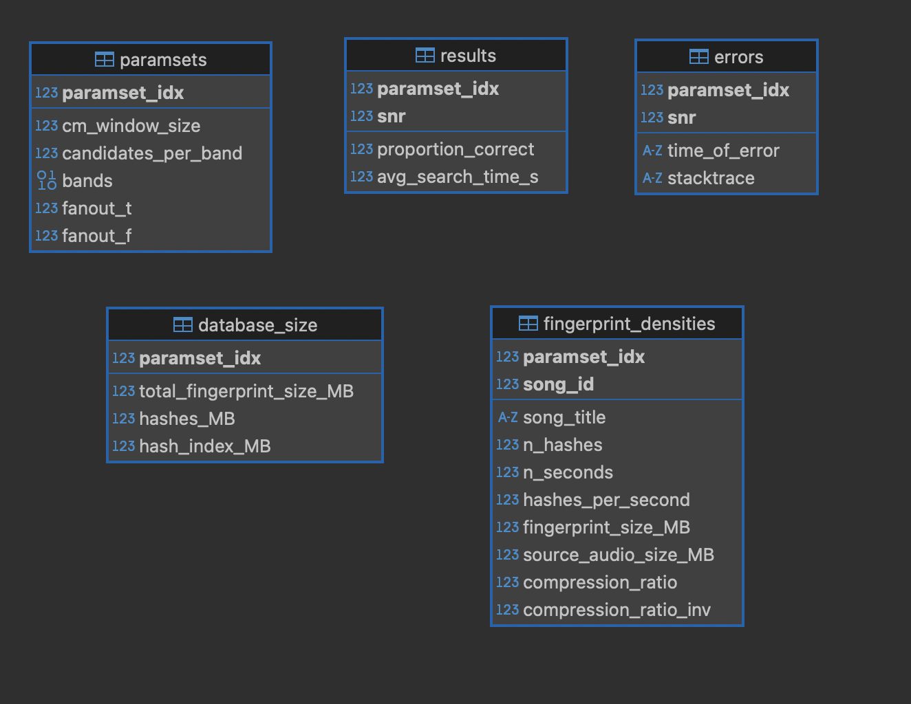

# Grid Search Implementation (optional)

Grid Search helps give some insight behind choosing one set of parameters over another.

TODO: Copy files from [F25-Shazam-GridSearch](https://github.com/dennisfarmer/F25-Shazam-GridSearch) (or from `Shazam-App-Template/Week_7`) to your `Shazam-App-Template/` directory

# `F25-Shazam-GridSearch/README.md`:

## Checklist of setup things
- create a Python environment or use your existing one: `python3 -m venv .env`, `source .env/bin/activate`, `pip install -r requirements.txt`
- download `tracks/` dataset from [Google Drive](https://drive.google.com/file/d/11zWYTmj4jxXbsz6bnfiSyVFxZQA4ZVma/view?usp=drive_link), or create your own music dataset with our [yt_dlp wrapper script](https://github.com/dennisfarmer/musicdl)
- Copy these files directly into your shared subgroup project repos. 

> The files to copy are `grid_search.py`, `parameters.py`, `grid_search.ipynb`, and `audio_samples/cafe_ambience.flac`. You might also have to `pip install pydub` if it's not installed. 

> Tip: you can make copies of the grid search notebook for each member in your subgroup: `grid_search_dennis.ipynb`, `grid_search_11-2-25-dennis.ipynb`, etc.

> Make sure to copy the cafe ambience file into your `audio_samples/` directory, instead of the parent directory with your Python files.

- Important: make sure the following Week 5 code modifications have been made:

`const_map.py:find_peaks_windowed()`:
```py
# Week 5: lines 69-70
from parameters import read_parameters
window_size, candidates_per_band, bands = read_parameters("constellation_mapping")
```

`hasher.py:create_hashes()`:
```py
# Week 5: lines 50-51
from parameters import read_parameters
fanout_t, fanout_f = read_parameters("hashing")
```

(Not important) optional additional modification - `DBcontrol.py:connect()`:
```py
# (for possible parallel computation of 
# grid search using multiple databases)
# Week 7: lines 18-19 
def connect() -> sqlite3.Connection:
    from parameters import read_parameters
    library = read_parameters("database")
    con = sqlite3.connect(library)
    return con
```


## Overview of grid search code

- `parameters.py`: globally set parameters in a json file for access by algorithm

- `grid_search.py`: grid search given parameter space subset, SNR ratios,..
- `grid_search.py:run_grid_search()`: perform grid search, returns GridViewer

- `grid_search.py:GridViewer`: object that grid search results are stored in
- `grid_search.py:GridViewer.filename`: path to SQLite database of results



## Write your data analysis code in `grid_search.ipynb` - example:

```py
# write in grid_search.ipynb
import grid_search as gs

################################
# prameter_space_subset format:
# Python dictionary
################################
# use parameter names from parameter.py
# possible keys:
#       "cm_window_size"
#       "candidates_per_band"
#       "bands"
#       "fanout_t"
#       "fanout_f"
# keys are respective variable names, values
# are a collection of possible values 
# (specify the subset of all possible 
#      parameter values to perform grid
#      search over)
parameter_space_subset = {
    "candidates_per_band": [6, 2]
}

signal_to_noise_ratios = [3, 6]

grid_viewer = gs.run_grid_search(
    parameter_space_subset,
    signal_to_noise_ratios,
    n_songs=4
)

```

## View results of grid search using SQLite

- using command line interface:
    - `sqlite3 sql/gridviewer.db`
- using Python:
```py

import sqlite3

con = sqlite3.connect(grid_viewer.filename)  # sql/gridviewer.db
cur = con.cursor()
res = cur.execute(
    "SELECT * "
    "FROM paramsets "
    "JOIN results on paramsets.paramset_idx = results.paramset_idx "
    "WHERE results.proportion_correct > 0.75 "
    "ORDER BY results.proportion_correct DESC "
    "LIMIT 10"
    ).fetchall()[0]

# For you to do: visualize different parameters and 
# their effects on fingerprint system parameters 
# using Matplotlib!
print(res)
```

| paramset_idx | cm_window_size | candidates_per_band | bands  | fanout_t | fanout_f | paramset_idx | snr | proportion_correct | avg_search_time_s |
|--------------:|---------------:|--------------------:|:------|---------:|---------:|-------------:|----:|-------------------:|------------------:|
| 0             | 10             | 6                   | �^D�* | 100      | 1500     | 0            | 3.0 | 0.8                | 0.00252225399017334 |

```py

# side note: bands are stored as BLOB objects 
# ("Binary Large Object" - sequence of bytes) in database
# convert to Python object using pickle.loads() - load pickle object string
import pickle
bands_for_paramset_0 = pickle.loads(res[3])
print(bands_for_paraset_0)

# [ 0, 10 ], [ 10, 20 ], [ 20, 40 ], [ 40, 80 ], [ 80, 160 ], [ 160, 512 ] ]

```

## Test optimal model from grid search on larger dataset

```py
import grid_search as gs
from DBcontrol import init_db
from parameters import set_parameters

n_songs = 10  # n_songs=None to use all songs
signal_to_noise_ratio = -3  # dB, negative => more noise than signal
samples = gs.sample_from_source_audios(n_songs, snr=signal_to_noise_ratio)

# initialize fingerprint database using selected parameter set
paramset_idx = 0
paramset = grid_viewer.paramset_idx_to_params(paramset_idx)
# **dict notation:
#         convert {"k1": "v1", "k2: "v2"}
#               -> k1="v1", k2="v2"
set_parameters(**paramset)
init_db(n_songs=n_songs)

# test recognition model on samples with SNR = -3 dB
proportion_correct, results = gs.perform_recognition_test(
    n_songs=n_songs, samples=samples,
    perform_no_index_searches=True,
    store_microphone_samples=True)

print(f"proportion correct = {proportion_correct}")
print(f"snr = {signal_to_noise_ratio}")
df = pd.DataFrame(results)
df.head()
```

<div>
<table border="1" class="dataframe">
  <thead>
    <tr style="text-align: right;">
      <th></th>
      <th>ground_truth</th>
      <th>prediction</th>
      <th>correct</th>
      <th>metrics</th>
      <th>search_time_with_index</th>
      <th>search_time_without_index</th>
      <th>microphone_audio</th>
    </tr>
  </thead>
  <tbody>
    <tr>
      <th>0</th>
      <td>1</td>
      <td>1</td>
      <td>True</td>
      <td>{1: {'std_of_deltaT': 15.800709955196966, 'n_h...</td>
      <td>0.002502</td>
      <td>1.374245</td>
      <td>[-0.013693006863094812, 0.24533119211236118, 0...</td>
    </tr>
    <tr>
      <th>1</th>
      <td>1</td>
      <td>1</td>
      <td>True</td>
      <td>{1: {'std_of_deltaT': 10.726124861473131, 'n_h...</td>
      <td>0.002579</td>
      <td>1.349979</td>
      <td>[0.027260447828950804, 0.08172861504929683, 0....</td>
    </tr>
    <tr>
      <th>2</th>
      <td>1</td>
      <td>1</td>
      <td>True</td>
      <td>{1: {'std_of_deltaT': 11.08108245181711, 'n_ha...</td>
      <td>0.002387</td>
      <td>1.330334</td>
      <td>[-0.5648264675677894, -0.8685998790153552, -1....</td>
    </tr>
    <tr>
      <th>3</th>
      <td>1</td>
      <td>1</td>
      <td>True</td>
      <td>{1: {'std_of_deltaT': 8.899807066008922, 'n_ha...</td>
      <td>0.002239</td>
      <td>1.331887</td>
      <td>[0.5275023473625762, 0.7203752289992055, 0.834...</td>
    </tr>
    <tr>
      <th>4</th>
      <td>1</td>
      <td>1</td>
      <td>True</td>
      <td>{1: {'std_of_deltaT': 25.800335022107838, 'n_h...</td>
      <td>0.002322</td>
      <td>1.417573</td>
      <td>[0.8277468471555032, 1.0, 0.6614867534996498, ...</td>
    </tr>
  </tbody>
</table>
</div>

## Previewing simulated microphone samples used in recognition tests, with a given signal-to-noise ratio

```py
import IPython.display as ipd
import soundfile as sf

signal_to_noise_ratio = -3  # dB, negative => more noise than signal
# samples = gs.sample_from_source_audios(n_songs, snr=signal_to_noise_ratio)
# first_sample_label = samples[0]["song_id"]
# first_audio_sample = samples[0]["microphone"]

first_audio_sample = df["microphone_audio"][0]
ipd.display(ipd.Audio(first_audio_sample, rate=11025))
sf.write("sample1.wav", first_audio_sample, 11025)
```